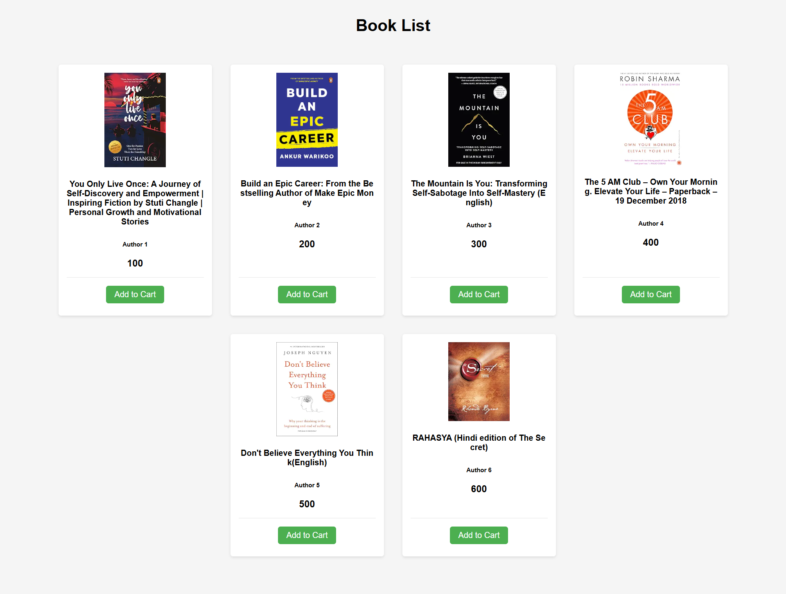

# Books - React Book Listing Application

A modern, responsive React-based application designed to showcase a curated collection of motivational and self-help literature. This project demonstrates a clean, component-oriented architecture with a focus on visual presentation and user interaction.

## ✨ Key Features

- **Elegant Book Gallery**: A beautifully styled grid layout presenting high-quality book covers and essential metadata.
- **Dynamic Content Rendering**: Utilizes a centralized data structure to dynamically render book components with unique titles, authors, and pricing.
- **Interactive Shopping Flow**: Integrated "Add to Cart" functionality with immediate user feedback.
- **Modern Responsive Design**: Leverages custom CSS and flexbox/grid for a seamless experience across mobile, tablet, and desktop devices.
- **Performance-First Architecture**: Built with modular components, ensuring optimal re-rendering and maintainability.

## 📸 Screens

| Page | Preview |
| :--- | :--- |
| **Home Page** |  |

---

## 🤝 Community & Contributions

Contributions are what make the open-source community such an amazing place to learn, inspire, and create. Any contributions you make are **greatly appreciated**.

- **Code of Conduct**: Please read our [Code of Conduct](CODE_OF_CONDUCT.md) to understand the standards of behavior we expect in our community.
- **Contributing**: Check out the [Contributing Guidelines](CONTRIBUTING.md) for details on our code of conduct and the process for submitting pull requests.
- **Security**: Please refer to our [Security Policy](SECURITY.md).
- **Issue Templates**: When opening an issue, please use the provided [Bug Report](.github/ISSUE_TEMPLATE/bug_report.md) or [Feature Request](.github/ISSUE_TEMPLATE/feature_request.md) templates.

---

## 📜 License

Distributed under the MIT License. See `LICENSE` for more information.
